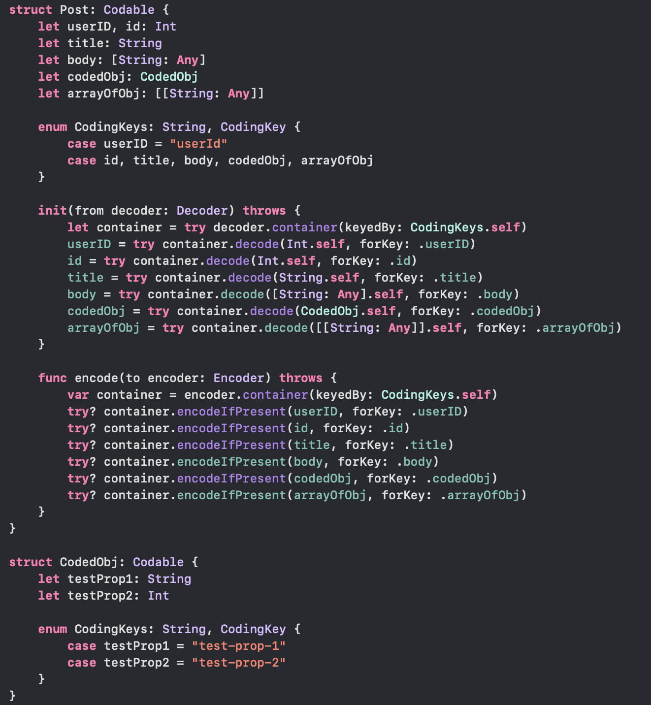
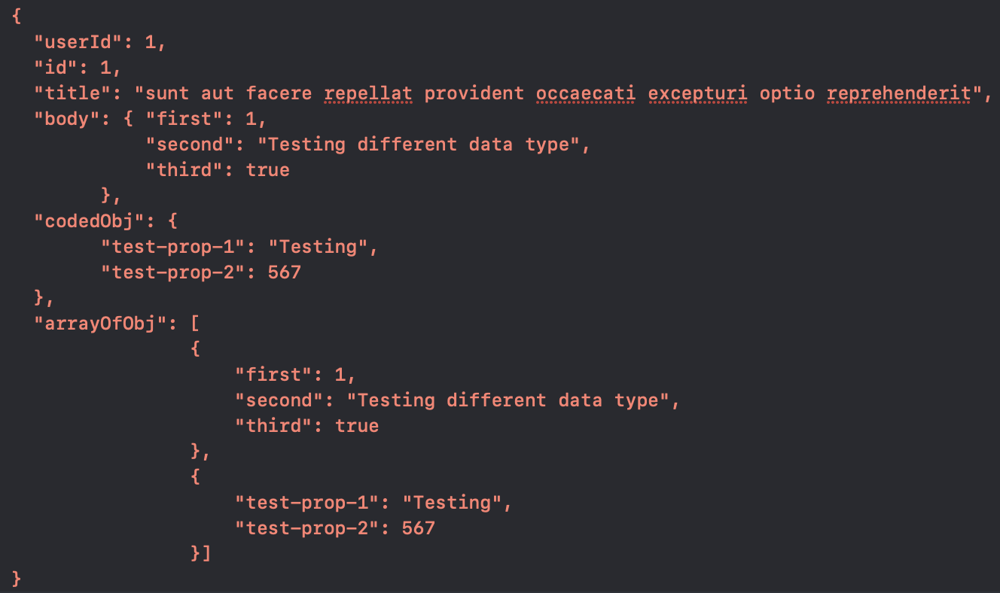

# Mastering Codables - [String: Any] support for Codable

A Sample project to demonstrate Encoding and Decoding codable properties with [String: Any] & [[String: Any]] data type. 
Contains Extension for implementing this and others to make your life a bit little easier while dealing with data. 
See the medium article here: https://satyenmaurya95.medium.com/string-any-support-for-codable-4ba062ce62f2

Sample JSON:

Codable class you will be able to achieve:

